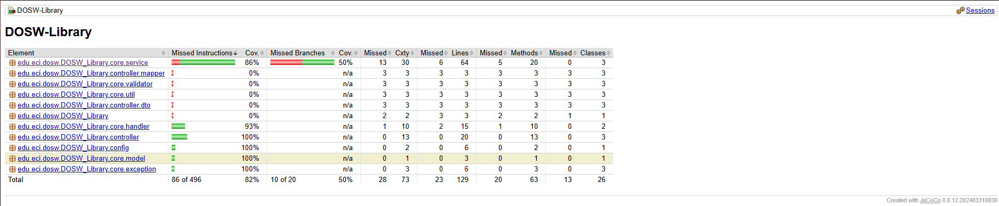
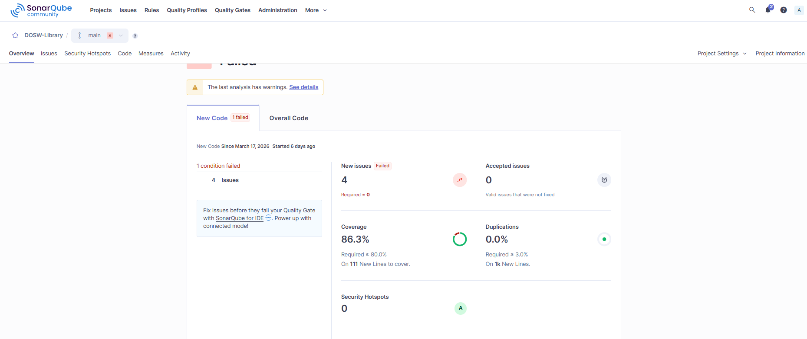
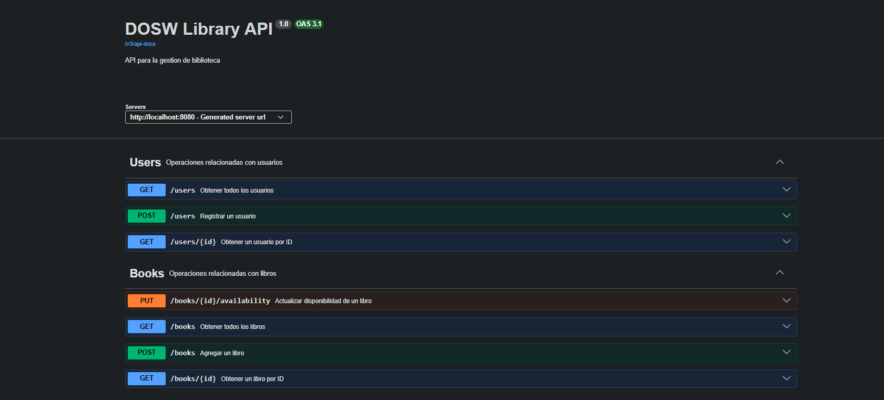
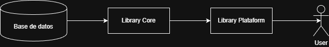

# DOSW Library

Repositorio correspondiente al  trabajo de la semana 7 y 8 de DOSW, en el cual se implementó una API para la gestión de biblioteca con las entidades **Book**, **User** y **Loan**, organizadas por capas **model**, **service** y **controller**.

## Ejecución de pruebas de servicios
En esta sección se presenta la evidencia de la ejecución de las pruebas unitarias realizadas con JUnit para los servicios del sistema, cubriendo escenarios exitosos y de error. 

## 4. Cobertura y análisis estático
En esta sección se presenta la evidencia de la cobertura de pruebas y del análisis estático del proyecto, tal como se solicita en la presentación.

### Cobertura con JaCoCo

### Análisis SonnarQube (Analisis estático)

Token: squ_3407a73fede833189fa6d02403f807c40d3804a0

## Api en swaggwer

## Video de las pruebas funcionales con cada endpoint simulando los flujos de usuarios, libros y de los préstamos.

***Adjunto a la entrega, porque no supe como subirlo al readme***

## Diagramas y descripciones

La Base de datos actúa como componente de almacenamiento de la información del sistema, el Library Core contiene la lógica principal del dominio y las reglas de negocio relacionadas con la gestión de libros, usuarios y préstamos, y el Library Platform funciona como la capa de exposición e interacción con el usuario, permitiendo el acceso a las funcionalidades del sistema.

## Bitácora
Para la bitácora de esta semana, la evidencia corresponde al enlace de este repositorio: 

https://github.com/David25300/Bitacora_Corte1.git