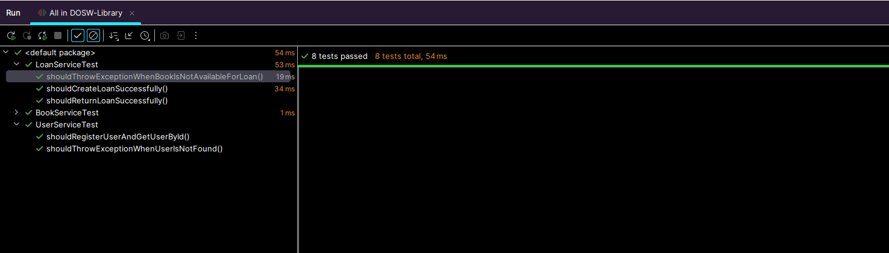
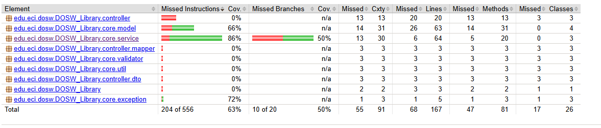
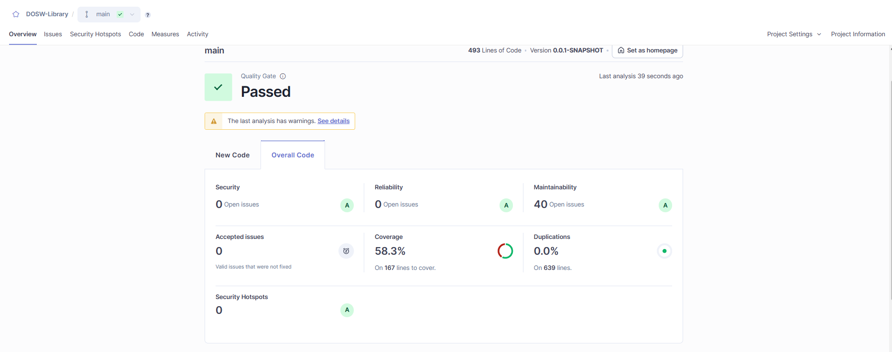

# DOSW Library

Repositorio correspondiente al  trabajo de la semana 7 y 8 de DOSW, en el cual se implementó una API para la gestión de biblioteca con las entidades **Book**, **User** y **Loan**, organizadas por capas **model**, **service** y **controller**.

## Ejecución de pruebas de servicios
En esta sección se presenta la evidencia de la ejecución de las pruebas unitarias realizadas con JUnit para los servicios del sistema, cubriendo escenarios exitosos y de error. [1](https://pruebacorreoescuelaingeduco-my.sharepoint.com/personal/david_cajamarca-c_mail_escuelaing_edu_co/Documents/Microsoft%20Copilot%20Chat%20Files/pom.xml)[1](https://pruebacorreoescuelaingeduco-my.sharepoint.com/personal/david_cajamarca-c_mail_escuelaing_edu_co/Documents/Microsoft%20Copilot%20Chat%20Files/pom.xml)

## 4. Cobertura y análisis estático
En esta sección se presenta la evidencia de la cobertura de pruebas y del análisis estático del proyecto, tal como se solicita en la presentación. [1](https://pruebacorreoescuelaingeduco-my.sharepoint.com/personal/david_cajamarca-c_mail_escuelaing_edu_co/Documents/Microsoft%20Copilot%20Chat%20Files/pom.xml)[1](https://pruebacorreoescuelaingeduco-my.sharepoint.com/personal/david_cajamarca-c_mail_escuelaing_edu_co/Documents/Microsoft%20Copilot%20Chat%20Files/pom.xml)

### Cobertura con JaCoCo

### Análisis estático

Token: squ_3407a73fede833189fa6d02403f807c40d3804a0

## 5. Bitácora
Para la bitácora de esta semana, la evidencia corresponde al enlace de este repositorio: 

https://github.com/David25300/Bitacora_Corte1.git